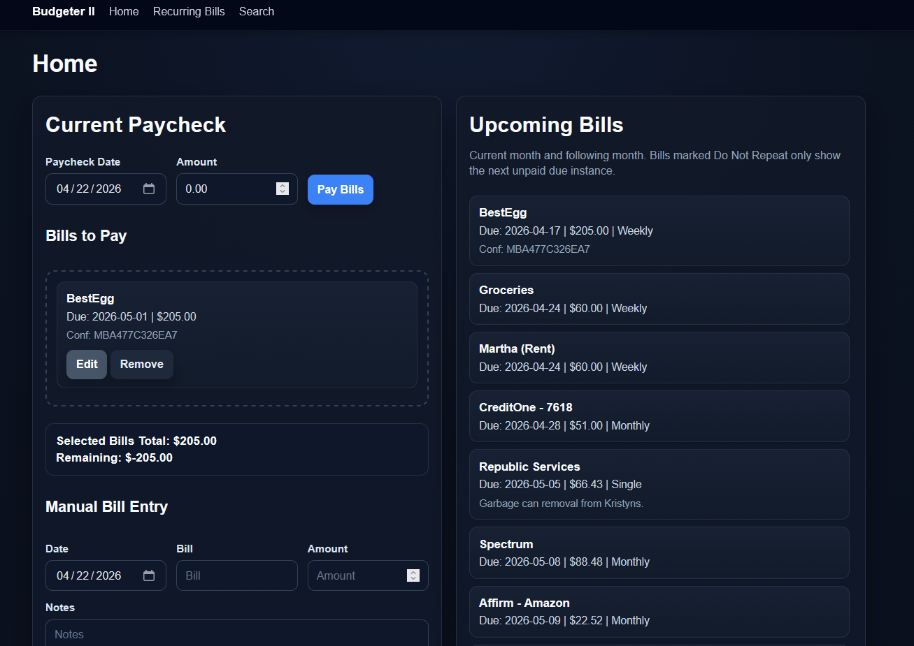
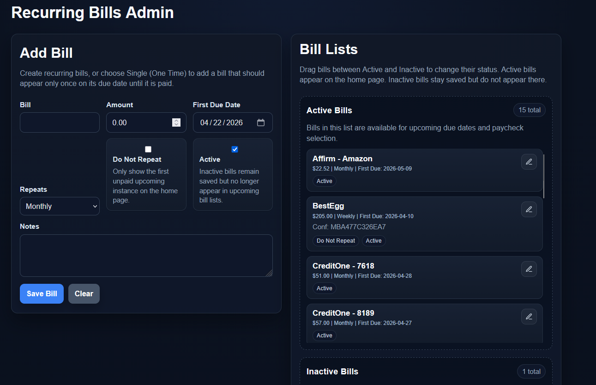
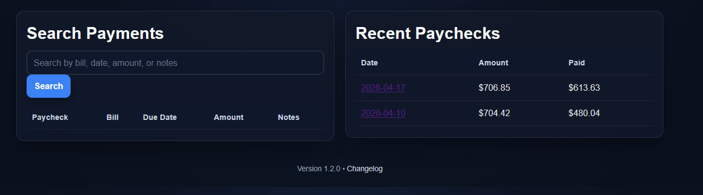

# Budgeter II

<p align="center">
  <strong>A practical paycheck-first budgeting app built with PHP and MySQL.</strong>
</p>

<p align="center">
  Track recurring bills, one-time bills, paychecks, overdue catch-up payments, and upcoming due dates in a clean local-first interface.
</p>

<p align="center">
  
  

  
</p>

---

## Why Budgeter II?

Budgeter II is built for real-world budgeting — not theory.

It is designed for people who budget by paycheck, need to manage recurring bills, sometimes add one-time expenses, and may need to catch up on overdue bills without losing visibility of what is still due.

Instead of burying everything in spreadsheets, Budgeter II gives you:

- a paycheck-based workflow
- a calendar-driven view of due dates
- a clean upcoming bills list
- recurring and one-time bill support
- practical handling for overdue and catch-up scenarios

---

## Features

### Paycheck-based bill planning
- Assign bills to a specific paycheck
- View selected bill total and remaining balance
- Edit an existing paycheck and continue where you left off

### Calendar-driven budgeting
- Monthly calendar view of bills and paychecks
- Quick visual distinction between paid and unpaid items
- Click a day to manage bills tied to that date

### Recurring and one-time bill support
- Weekly
- Bi-weekly
- Monthly
- Every 3 months
- Single / one-time bills

### Smart "Do Not Repeat" behavior
- Keeps unpaid instances visible for catch-up workflows
- Supports multiple unpaid instances so overdue bills can be paid down in groups
- Prevents bills from disappearing from the upcoming list too early

### Upcoming Bills workflow
- Shows current and following month bills
- Supports dragging bills into the current paycheck
- Keeps budgeting focused and fast

### Manual one-time bill entry
- Add custom bills on the fly
- Useful for irregular payments, surprise expenses, or special cases
- Notes supported

### Recurring Bills admin
- Add, edit, activate, and deactivate bills
- Separate active and inactive bill lists
- Scrollable bill management for larger lists

### Paycheck view and editing
- Review all bills paid from a paycheck
- Add more bills to an existing paycheck
- Continue editing without losing already attached bills

---

## Screenshots

### Home


### Recurring Bills Admin


### Search / Paycheck History


---

## How it works

### 1. Create recurring bills
Add your regular bills in **Recurring Bills** and choose the repeat pattern that matches the bill.

### 2. Open Home
On the **Home** page, choose the paycheck date and amount.

### 3. Move bills into Bills to Pay
Drag bills from **Upcoming Bills** into the **Bills to Pay** area.

### 4. Add manual bills if needed
Need to add a one-off bill or unusual expense? Use the **Manual Bill Entry** area.

### 5. Save the paycheck
Once saved, the paycheck records the selected bills and can be reopened later for edits or additions.

---

## Installation

### Requirements
- PHP 7.4+
- MySQL or MariaDB
- A local or hosted PHP server environment

Examples:
- XAMPP
- Laragon
- UniServer Zero
- Other PHP/MySQL stacks

### Setup
1. Clone or download this repository
2. Place it in your web root
3. Update your database settings in `config.php`
4. Open the project in your browser
5. The app will create or update required tables on load

Example local path:

```text
/www/projects/budgeter
